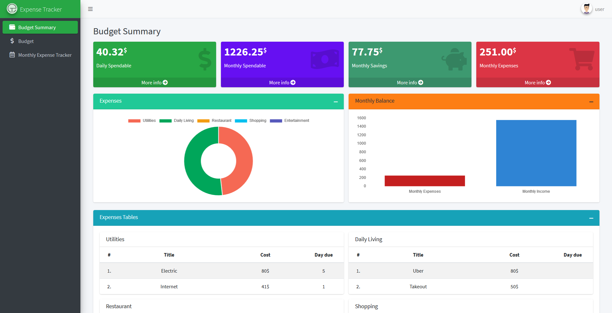
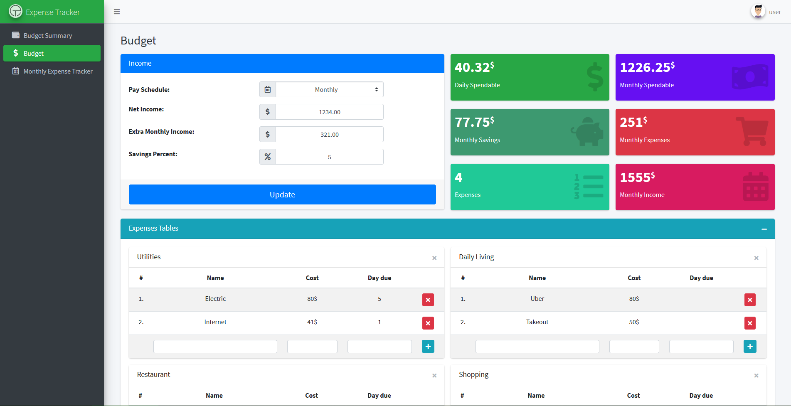
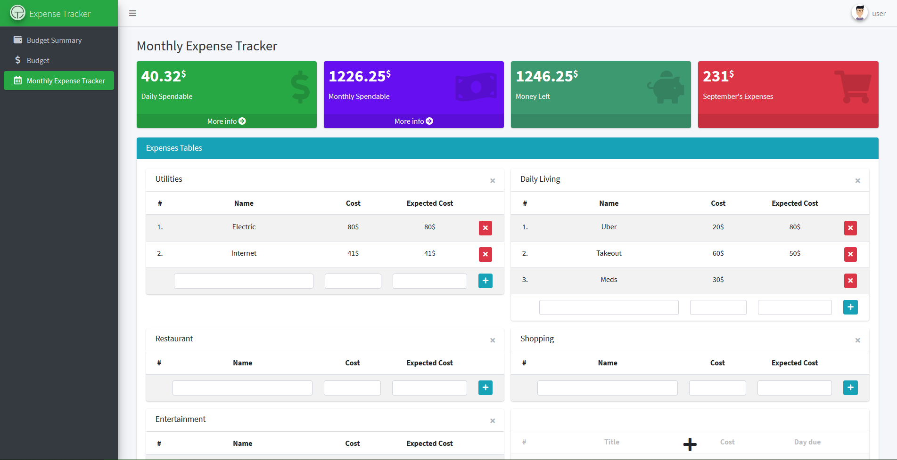

# Expense Tracker

An expense tracker app built with Django framework. It is designed as a simple tool to organize your finances.

## Installation

1. Create a Python 3.8 virtualenv

2. Install dependencies:

    ```bash
    pip install -r requirements.txt
    ```

3. Create a file "local_settings.py" in a directory named 'expense_tracker' containing the DATABASES configuration.

4. Create tables:

    ```bash
    python manage.py migrate
    ```

## Usage

```bash
python manage.py runserver
```

## Features

-   ### Budget Summary

    This page gives a summary of your Expenses, your Income, and your Budget values. It tells you what your flexible spending is, and how much you can afford to spend daily (or weekly or monthly) and still save money and meet your budgeting and savings goals!

-   ### Budget

    -   The income card is made to allow you to input your income. Select from monthly, bi-monthly, bi-wieekly and weekly income. There is an extra monthly income section to add any regular income that isn’t accounted for. This card also allows you to select what percent of your income will be put into savings.

    -   Gives you more information about your Expenses,Income and Budget values.

    -   In the Expenses card you can add/delete/edit categories and expenses.

-   ### Monthly Expense Tracker

    This page is meant as a monthly tracker to give a more realistic picture of where your money is being spent. You can use this to compare your actual spending to your desired expenses at the end of the month.

## Running the tests

```python
python manage.py test [list of app labels]
```

## Screenshots

### Budget Summary



### Budget



### Monthly Expense Tracker



### As staff


## TODO

-   Daily Expense Tracker
-   Large Purchase Calculator
-   Front-end update
